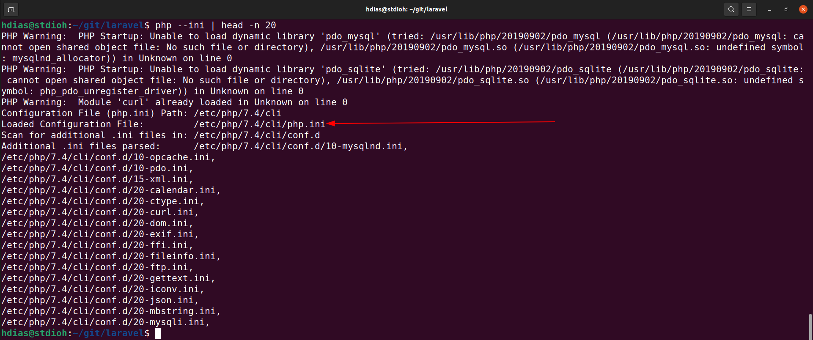
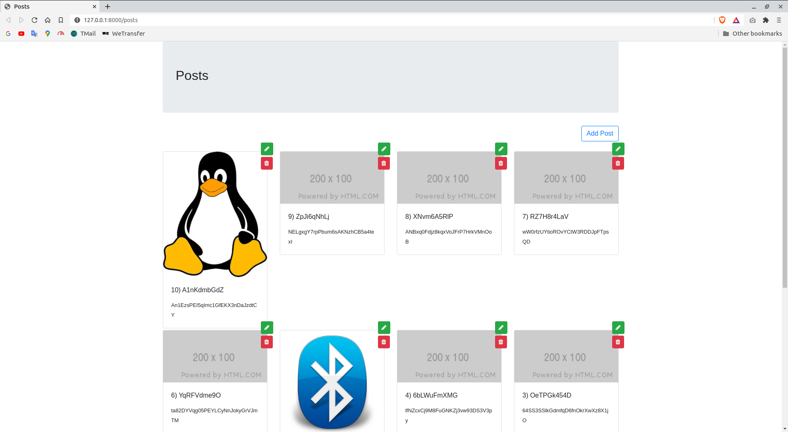
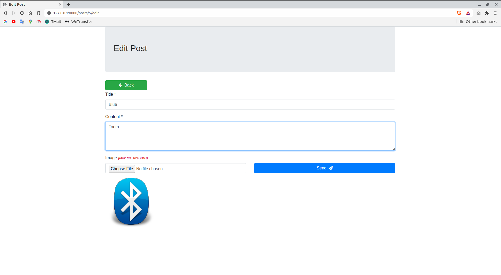

# Testing Laravel 8 + Sqlite + Imgbb

A simple laravel CRUD using sqlite as the db and the service ImgBB to upload some images.


# Demo
**https://laravel8-posts.herokuapp.com**

# Requirements
* [PHP >= 7](https://www.php.net/downloads.php) 
* [Composer >= 2](https://getcomposer.org/download/)


# Setup
> Note: `Before messing with the project, it is necessary to configure the **PHP**.`<br>
`We accomplish this by editing the **"php.ini"** file, to find out what is your path:`

```bash
php --ini
```


Access the php.ini and modify these following lines:
```
;extension=curl -----------> extension=curl
;extension=pdo_mysql ------> extension=pdo_mysql
;extension=pdo_slite ------> extension=pdo_slite

memory_limit = 128M -------> memory_limit = -1
upload_max_filesize = 2M --> upload_max_filesize = 100M
post_max_size = 10M -------> post_max_size = 100M
```

<div class="text-blue">

Now with the configurations ready we can start our project:

</div>

```bash
git clone https://github.com/stdioh321/laravel.git
cd laravel 
composer install
php artisan migrate:fresh --seed --env=example # (optional) [--port=8080] [--host=0.0.0.0]
```


# Run
```bash
php artisan serve --env=example
```
<div class="text-gray">
The parameter "--env=example" was applied in order to laravel use the ".env.example" file. 
</div>

Open your browser at:

### **http://localhost:8000**

| Posts  | Edit Post |
| ------------- | ------------- |
|   |   |

# Run with Docker
```bash
docker run -p8000:8000 -it diaslinoh/laravel-posts:latest

```


Open your browser at:

**http://localhost:8080**


# References

* [Laravel](https://laravel.com/docs/8.x/)
* [ImgBB](https://imgbb.com/)
